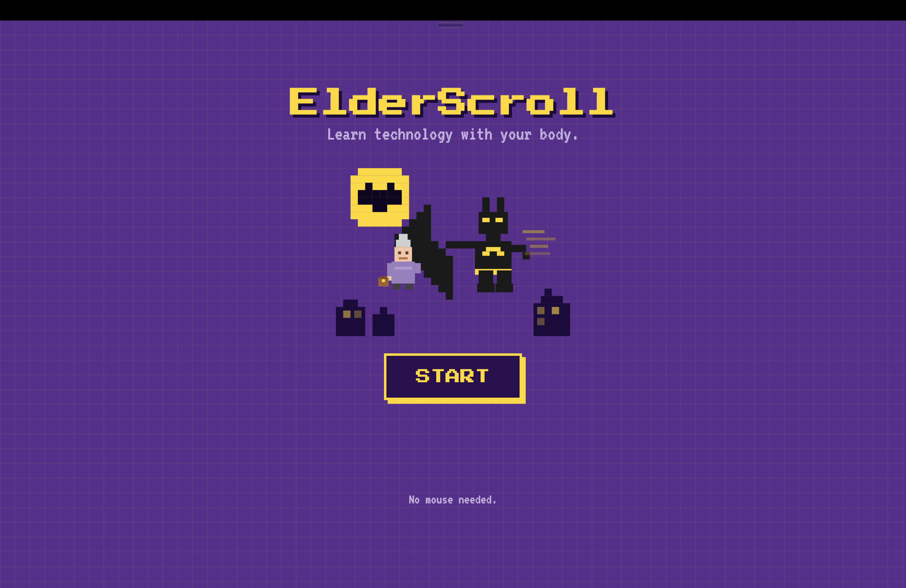
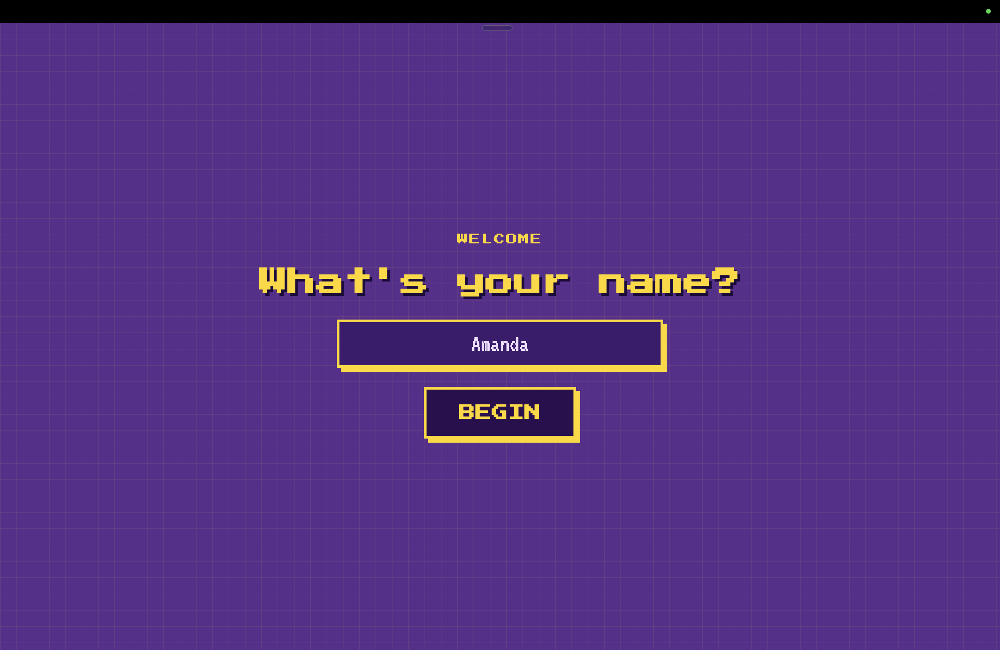
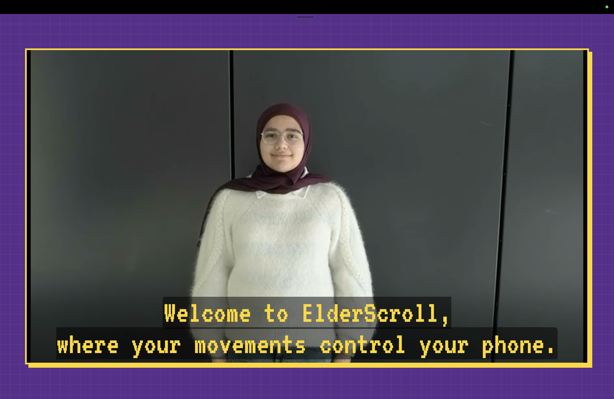
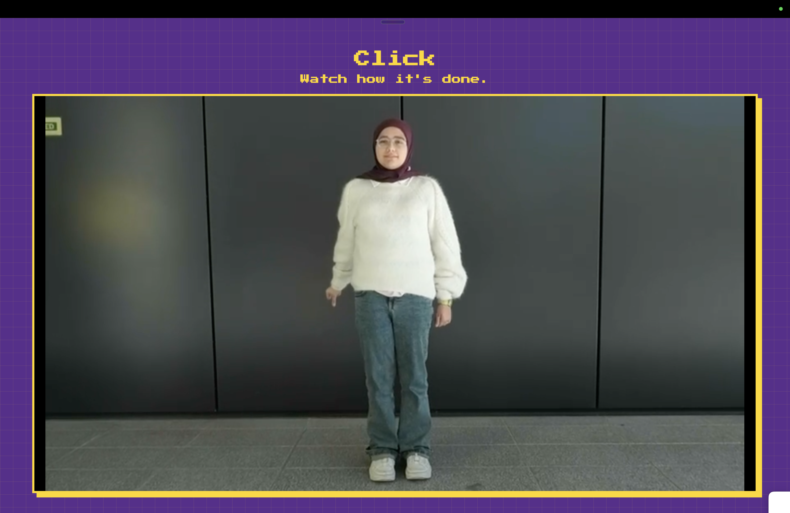
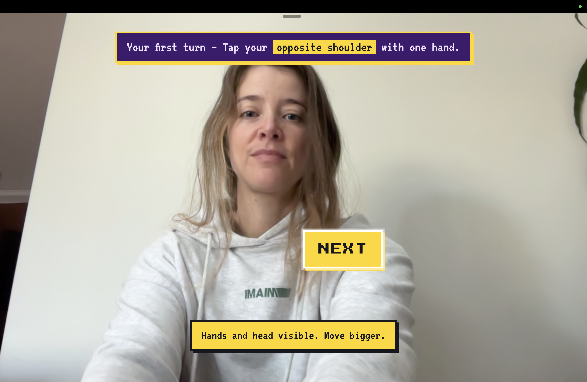
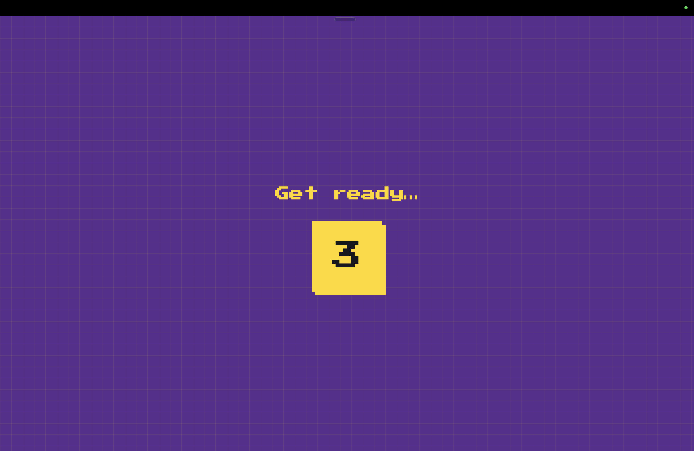
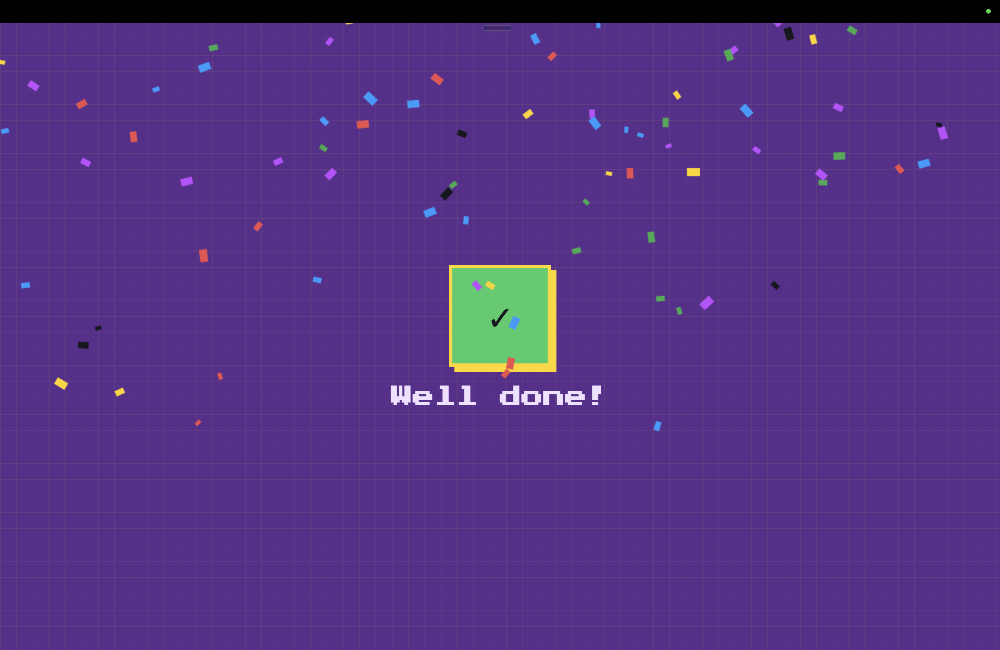
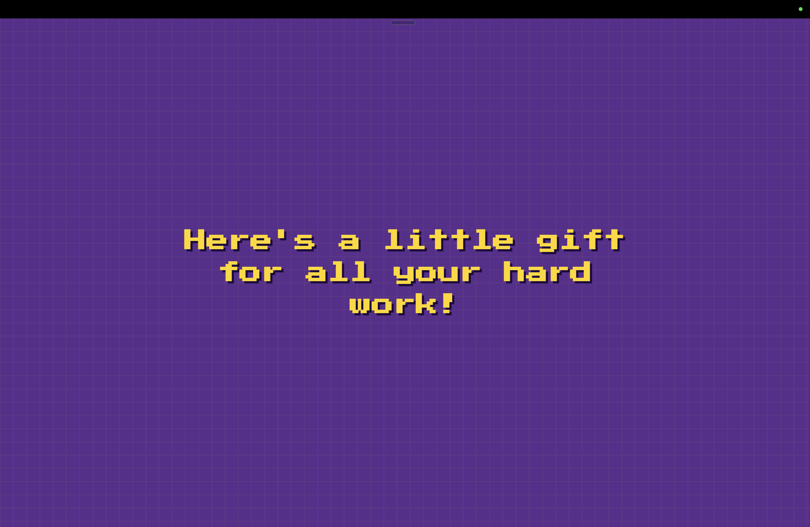
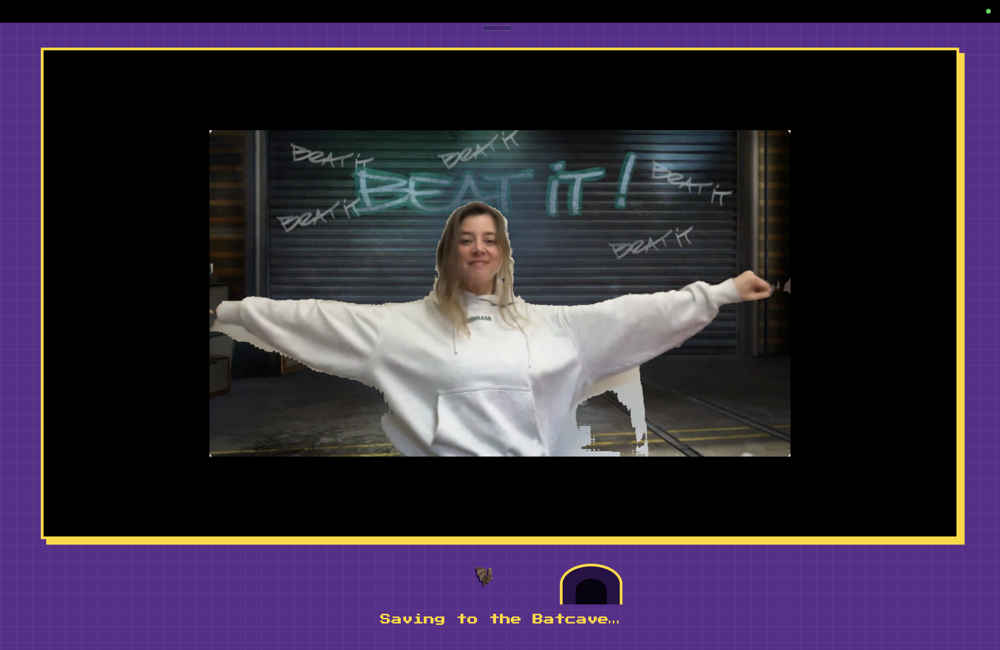
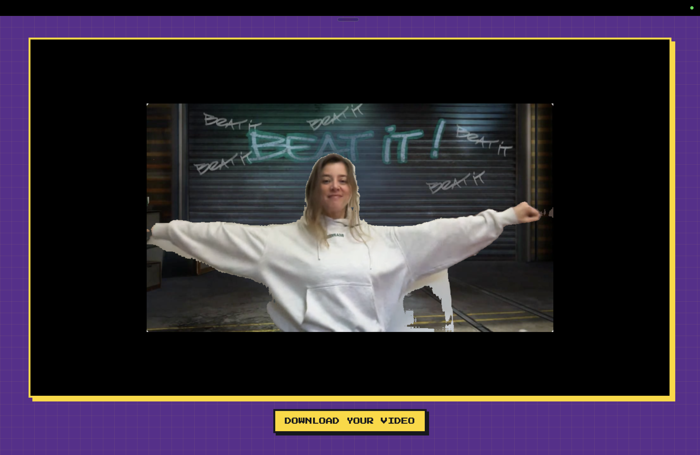

# ElderScroll

A localhost hackathon app that disguises dance-move recording as technology lessons.
MediaPipe detects five body gestures in the browser. Each lesson has two practice
rounds; only Practice 2 is recorded.

At the end, the five clips are rendered into one reel, downloaded locally, uploaded
to the Lovable video library, and shown with a participant-specific download link.

<p align="center">
  
</p>

## The bit

On the surface, ElderScroll "teaches elderly people technology" by mapping body
movements to digital actions. That framing is misdirection. Each gesture secretly
corresponds to a move from a specific TikTok dance. While participants think they're
learning tech, the laptop camera records them performing the moves — and the clips
are stitched into a side-by-side recreation of the original TikTok. The reveal is the
payoff.

## The Batman mask

Some participants are shy about being on camera — so we 3D-printed a Batman mask
anyone could wear to hide their identity while they "learn."

The idea came from a teammate's husband, a child psychologist. He gives kids a
Batman mask when they're scared to face something — a challenge at school, a fear
they can't get past — because if *they* can't do it, Batman can. The mask gives
them a braver self to step into. We borrowed the same trick: put the mask on, and
performing daft "tech lessons" in front of a camera stops being so daunting. (It's
also why the reveal renders "to the batcave.")

## The user journey

| | |
|---|---|
| **1. Landing** — start the camera. <br> | **2. Name** — the participant signs in. <br> |
| **3. Intro** — a welcome video sets the cover story. <br> | **4a. Tutorial** — each lesson opens with a how-to clip. <br> |
| **4b. Practice** — the participant tries the gesture. <br> | **4c. 3-2-1** — a countdown before the recorded take. <br> |
| **4d. Success** — gesture detected, on to the next. <br> | **5. Gift** — after the last lesson, a short message. <br> |
| **6a. Saving** — the reel renders ("to the batcave"). <br> | **6b. Reveal** — the finished reel plays with a download link. <br> |

## The team

Five people, none of them professional software engineers: a mechanical engineer,
an electrical engineer, a 14-year-old, a product manager, and an operations manager.
The prototype started in ChatGPT; from there we extracted the code, wrote a quick
PRD off a flow-mapping session, and vibe-coded the rest over about two days.

## Run it

Open two terminal windows in this folder.

Terminal 1 — serve the app:

```sh
ruby -run -e httpd . -p 8000
```

Terminal 2 — run the Lovable upload bridge:

```sh
LOVABLE_ADMIN_PASSCODE="your-passcode" node upload-helper.mjs
```

Use the admin passcode configured in the Lovable project. Keep it local; do not
commit it to GitHub.

Then open Chrome at:

```text
http://localhost:8000/
```

Do not open `index.html` directly with a `file://` URL. Camera access and browser
modules require localhost.

## Flow

1. Start the camera and enter the participant's name.
2. Watch the intro.
3. Complete five lessons: Click, Move, Zoom In, Zoom Out, and Take a Photo.
4. Each lesson runs tutorial → Practice 1 → Practice 2.
5. Practice 2 is recorded silently.
6. After the final lesson, a short gift message appears.
7. The clips render in lesson order and automatically play.
8. A local copy downloads and the Lovable download link appears.

## Presenter controls

- `Space` — perform the gesture expected by the current practice screen.
- `S` — testing only: skip the current video, countdown, practice, or feedback screen.
- `R` — testing only: record a five-second clip.
- `P` — testing only: render and preview all clips recorded so far.
- `F` — testing only: jump to the final gift message, then play the current reel.
- `d` — toggle gesture-debug values.
- `i` — invert the reveal segmentation mask if the foreground/background is reversed.

Remove the `S`, `R`, `P`, and `F` testing controls and the visible test-recording status
before the final public demo.

## Important files

- `app.js` — gesture detection, lesson flow, recording, reel rendering, and upload.
- `personas/elders/content.js` — lesson order, copy, and gesture mappings.
- `personas/elders/config.js` — gesture thresholds, timing, and upload settings.
- `upload-helper.mjs` — local bridge to the Lovable upload endpoint.
- `assets/tutorials/` — intro and lesson tutorial videos.
- `assets/background-beat-it.jpeg` — optional reveal background.

Chrome is recommended. The first run requires internet access to download MediaPipe
models. If background segmentation fails, reel creation continues with the real
camera background.

## Inspiration

The secret choreography is taken from this TikTok:
[@nathanlust](https://www.tiktok.com/@nathanlust/video/7626403103511776532).
</content>
</invoke>
